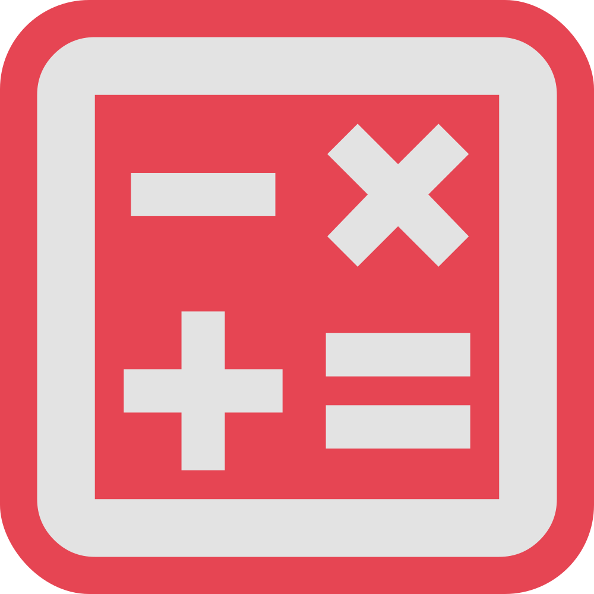
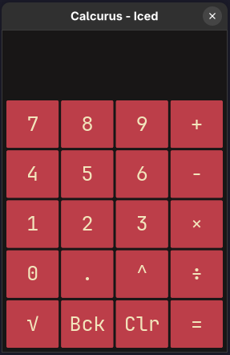

<p align="center">
  
</p>

<h1 align="center">Calcurus</h1>


<p align="center">
  
</p>


### [Calcurus](https://redddfoxxyy.github.io/Calcurus/) is a simple calculator written in Rust using the [iced](https://github.com/iced-rs/iced) framework.

It can run on any platform/os that is supported by the rust compiler, including wasm!

## Features

- Basic arithmetic operations (addition, subtraction, multiplication, division, exponentiation) with integers and
  floating-points
- Graphical user interface (GUI) using the iced framework.
- Can also be compiled to web assembly using trunk! You can test Calcurus right now without installing it on this
  website: https://redddfoxxyy.github.io/Calcurus/

## Installation

- AppImage and Standalone Executables are available for download for linux-x86_64 and Windows_x86_64 on
  the [releases](https://github.com/RedddFoxxyy/Calcurus/releases) page.
- For other platforms, you can compile it yourself, following the instructions below.
- Requires Fedora 42 or Ubuntu 24.04 or latest linux distro.

## Compilation

1. **Prerequisites:**
    - Ensure you have Rust installed. If not, follow the official installation guide for your platform: Rust
      Installation Guide.

2. **Clone the Repository:**
   ```bash
   git clone https://github.com/RedddFoxxyy/Calcurus.git
   cd calcurus
   ```

3. **Build the Project:**
   ```bash
   cargo build --release
   ```

4. **Run the Executable:**
    - After building successfully, you’ll find the release executable in the target/release directory. Run it from the
      project root:

   ```bash
   ./target/release/calcurus
   ```
    - Alternatively, you can run it using the `cargo run --release` command:

## Contributing:

- Contributions are welcome! If you’d like to contribute to Calcurus, open a PR with changes, features or fixes, and I
  will review and merge them.

## License:

Calcurus is licensed under the GNU AFFERO GENERAL PUBLIC LICENSE Version 3 and “Commons Clause” License Condition v1.0.
See the LICENSE-CC files for details.
